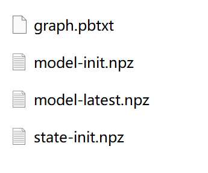

# CSCI544-project
## Introduction
This repo contains file for model training for context-aware model using Tensorflow (support on CPU), and model training for fairseq model on GPU.
Data file (test) and build file are in cpu/scripts/data, cpu/scrpits/build
## Context-Aware model on CPU
### Run code
#### Create a conda environment


#### bash train_baseline.sh -> this will create the basic translation model

change the REPO PATH to data to your local path

#### bash train_cadec.sh -> this will create the context-aware translation model

change the REPO PATH to data and model checkpoint to your local path

#### python test.py
The test accuracy is calculated on samples of different context ambiguity. Sample sentences:


Test result is the accuracy of the translation of different phenomenon based on [data] (https://github.com/lena-voita/good-translation-wrong-in-context/tree/master/consistency_testsets)


## Context-Aware model on GPU

This model is an implementation of context-aware models based on fairseq. Reference: [When Does Translation Require Context? A Data-driven, Multilingual Exploration](https://arxiv.org/abs/2109.07446)


### Environmental Configuration

- [Fairseq](https://github.com/pytorch/fairseq) >= [add65ad](https://github.com/pytorch/fairseq/commit/add65adcc53a927f99a717d90a9672765237d937)
- [SentencePiece](https://github.com/google/sentencepiece) >= 0.1.90
- [COMET](https://github.com/Unbabel/COMET)
- Python == 3.10

Also run

```
pip install -e .
```


### Data

We preprocessed the OpenSubtitles2018 (Lison et al., 2018) data, and the data after preprocessing was placed in `.data/mtdata`.


### Code Implementation

We use Google Colab to execute the following code:

```python
!chmod +x csci544/gpu/install_packages.sh
!./csci544/gpu/install_packages.sh
!./csci544/gpu/get_and_split_data.sh
!./csci544/gpu/run_baseline.sh
!chmod +x csci544/gpu/scat_preprocess.sh
!./csci544/gpu/scat_preprocess.sh
!./csci544/gpu/run_attnreg.sh
!chmod +x csci544/gpu/run_inference.sh
!./csci544/gpu/run_inference.sh
!pip install unbabel-comet
!chmod +x csci544/gpu/run_evaluation.sh
!./csci544/gpu/run_evaluation.sh
```


For our project's model file, please refer https://drive.google.com/drive/folders/1hWjpLnt9qyRHPnP6R98RULyp4FOvDOIz?usp=drive_link.

## Reference repo:
##### 1. https://github.com/lena-voita/good-translation-wrong-in-context
##### 2. https://github.com/libeineu/Context-Aware
##### 3. https://github.com/neulab/contextual-mt
